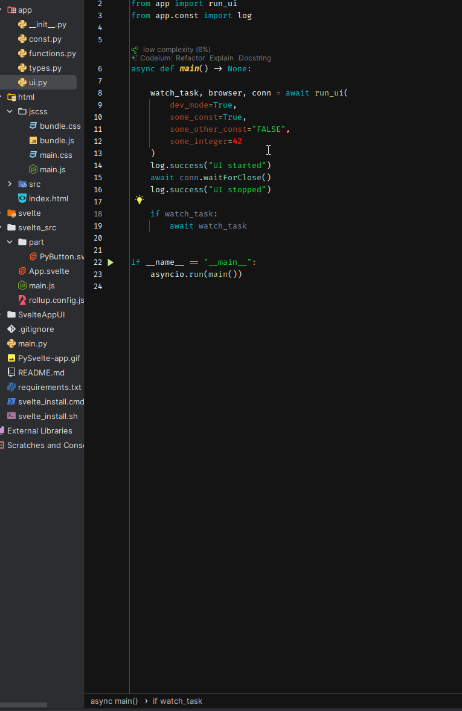

## Python + Svelte = Love in browser!
### Обновлено до Svelte 5 + Vite
Шаблон-заготовка для написания асинхронного UI в окне браузера, обеспечивая из одной коробки доступ не только к превосходной графике и современным решениям, но и кроссплатформенность, а использование [Svelte](https://svelte.dev/) оборачивает эту реализацию в нативную реактивность.



Шаблон структурирован и настроен так, чтобы `*.svelte`-исходники собирались в папке `html/jscss`.

> [!IMPORTANT]
> Svelte исключён из версионирования в `.gitignore`. Закомментируйте это правило после установки.

### Process
Для удобства, пригодится сразу два редактора, но это скорее дело объёма. У меня весь проект открыт в PyCharm, а в VSCode папка `svelte`. Это отделяет мух от котлет, однако заветное `npm run build` для сборки Ваших `*.svelte`-файлов в бандлы, может быть запущено только в расположении папки `svelte`.

Выглядит как геморрой?
Возможно, на первый взгляд.
Пока не попробуешь, всё может казаться не простым.

### Install
> [!IMPORTANT]
> <b><u>В системе должна быть установлена последняя версия</u></b> [NodeJS](https://nodejs.org/).

Клонируйте этот репозиторий.
Выполнение сценария `prepare.cmd` создаст виртуальное окружение и установит зависимости.

Сценарий `svelte5install.cmd` установит Svelte и сконфигурирует начальное состояние для работы.

После этого выполните из терминала `npm run build` в расположении папки `svelte`, которая была создана на предыдущем шаге и по пути `project_name/html/jscss/` должны будут появиться `main-app.js` и `main-app.css` файлы. Если терминал открыт в редакторе, то чтобы постоянно не переходить в рабочий каталог `svelte` для запуска сборки, для расположения из корня проекта можно указать префикс пути следующим образом:
```shell
npm --prefix .\svelte run build
```
В Linux, соответственно, слэш будет в другую сторону.

Выполните `run.cmd`, или запустите `main.py` из вашего PyCharm.

Enjoy!

### About
#### Как добавлять функционал?

В `app/functions.py` есть функция `extend()`, как пример. Внутренний хендлер `button_counter()` вызывается событиями из JS-контекста, при вызове JavaScript-функции `py_call()`, вызов которой описан в 10 строке в документе [PyButton.svelte](svelte_src/part/PyButton.svelte).

Подробнее о том, как работает механизм регистрации слушателей, [смотрите во втором примере библиотеки](https://github.com/PieceOfGood/aio_dt_protocol) `aio-dt-protocol`.

#### Ещё кое-что
Функция `run_ui()` принимает два полезных аргумента:
  * `dev_mode: bool = False` — позволяющий отслеживать изменения ресурсов и обновлять UI, как livereload в серверных инструментах
  * `**constants: any` — key_value-контейнер, добавляющий в контекст UI одноимённые константы в верхнем регистре
